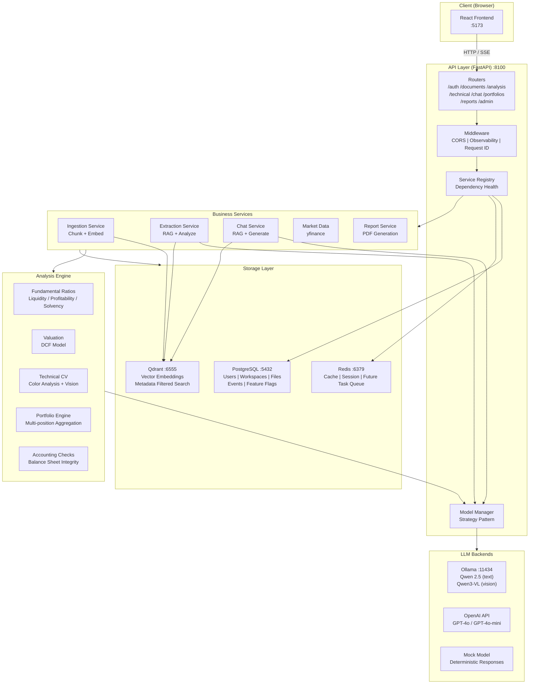
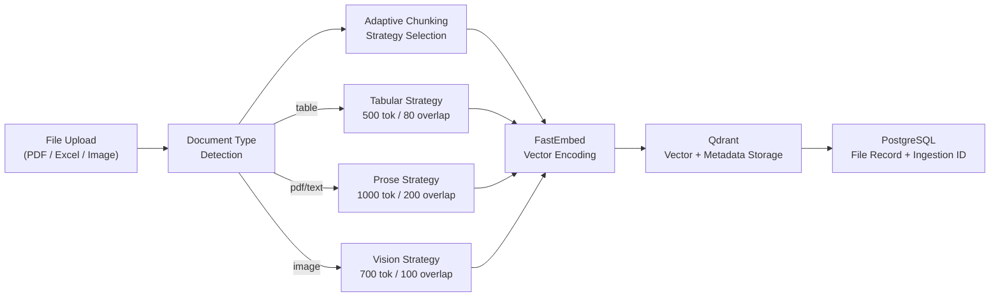
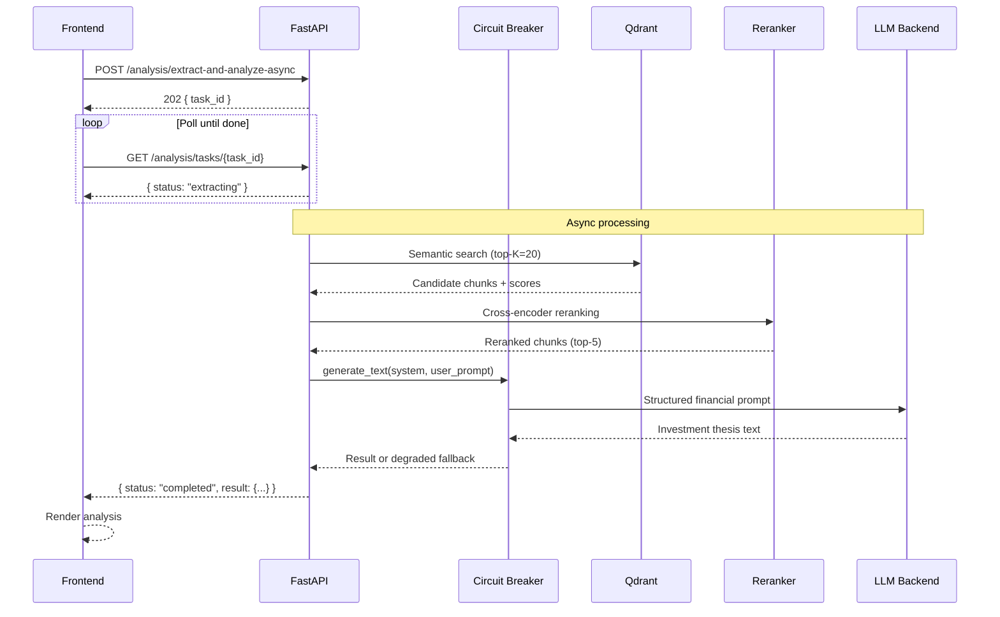
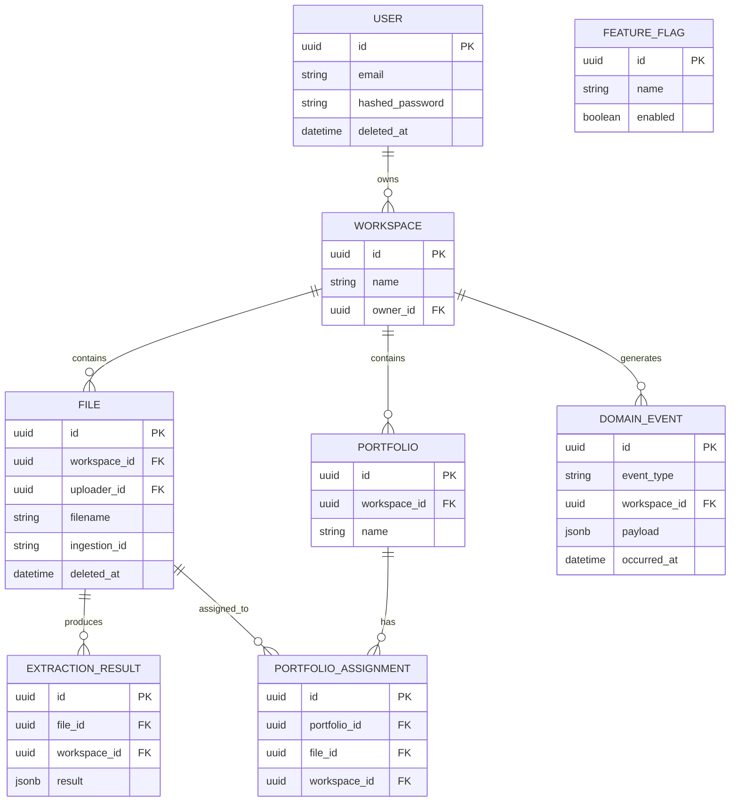
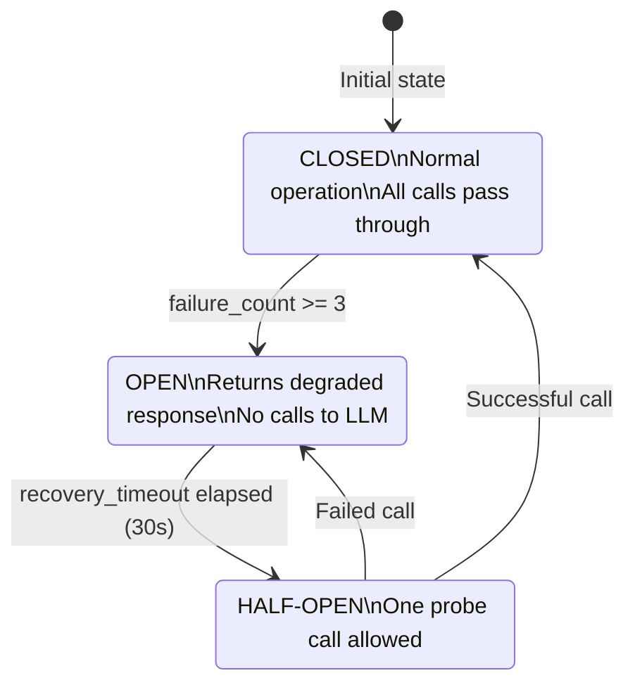

# AsiFin — Model-Agnostic Financial Analysis AI

> **A financial analysis platform that plugs any LLM into a structured analysis pipeline — from document ingestion to investment thesis generation.**

**Status:** Architecture and design documentation. The implementation is not published
in this repository.

AsiFin was built as a full-stack system: a FastAPI backend with an async task pipeline,
a React frontend, Postgres, Qdrant for vectors, Redis, and Ollama for local inference.
What follows documents the architecture and the reasoning behind each decision. The
deployment topology in [`reference/`](reference/) records the service layout; it is not
a runnable build, because the application source is not included.

---

## Table of Contents

- [What Is AsiFin?](#what-is-asifin)
- [Why This System? (A Systems Builder's Perspective)](#why-this-system-a-systems-builders-perspective)
- [Feature Overview](#feature-overview)
- [Architecture](#architecture)
- [Tech Stack](#tech-stack)
- [Deployment Topology (Reference)](#deployment-topology-reference)
- [Development Setup (Reference)](#development-setup-reference)
- [API Reference](#api-reference)
- [Configuration](#configuration)
- [Testing (Reference)](#testing-reference)
- [Observability](#observability)
- [Deployment Notes](#deployment-notes)
- [Contributing](#contributing)

---

## What Is AsiFin?

AsiFin is a full-stack AI-powered financial analysis system. You upload financial documents (PDFs, spreadsheets, charts), and the system extracts structured data, runs quantitative analysis, and produces LLM-generated investment insights.

It is designed around one core principle: **the LLM is a replaceable component**. The analysis pipeline, data models, and API contracts are entirely independent of which model backs the intelligence layer — you can run it locally with Ollama/Qwen, plug in OpenAI's GPT-4o, or swap in any other provider without touching business logic.

**Who is this for?**
- Equity research teams who want AI-augmented workflows without vendor lock-in
- Developers building financial tooling on top of LLMs
- Engineers who want a reference implementation of a production RAG + async analysis system

---

## Why This System? (A Systems Builder's Perspective)

This section explains the key architectural decisions and why they were made the way they were.

### 1. Model Agnosticism via the Strategy Pattern

Most AI-powered tools hardcode a specific provider. This creates vendor lock-in, unpredictable costs, and brittleness when APIs change. AsiFin uses a `LLMBase` abstract class as the interface contract. The `ModelManager` (factory + proxy) selects the backend at startup from environment configuration and can be reloaded at runtime.

```
LLMBase (ABC)
  ├── MockModel          — deterministic, zero-latency, for tests
  ├── OllamaModel        — local inference, no API cost, privacy-preserving
  └── OpenAIModel        — cloud inference, GPT-4o class models
```

This means you can develop and test on `mock`, run the full stack locally on `ollama`, and deploy to production on `openai` — all with a single environment variable change.

### 2. RAG Over Fine-Tuning for Financial Documents

Financial documents are long, heterogeneous, and change constantly (new quarterly reports, new companies). Fine-tuning a model on this data is expensive, slow, and produces a model that goes stale quickly.

RAG (Retrieval-Augmented Generation) solves this by treating the document corpus as a live knowledge base. When a user uploads a 10-K, it gets chunked, embedded, and stored in Qdrant. When the LLM generates an analysis, it retrieves the most relevant passages at query time — always using the freshest data.

The chunking strategy is **document-type-aware**:
- **Tables/spreadsheets**: smaller chunks (500 tokens), tabular strategy
- **PDFs/prose**: larger overlapping chunks (1000 tokens), prose strategy
- **Images/charts**: vision-specific chunks with computer vision preprocessing

This prevents the loss of table structure that plagues naive PDF splitters.

### 3. Circuit Breakers on Every LLM Call

LLM APIs are not reliable infrastructure. They time out, rate-limit, and have unpredictable latency. Wrapping every LLM call in an `AsyncCircuitBreaker` with configurable failure thresholds and recovery timeouts means the system degrades gracefully instead of cascading failures.

When a circuit is open, the system returns a structured degraded response immediately rather than holding a user request for 30+ seconds before timing out.

### 4. Async Task Pattern for Long-Running Analysis

Financial analysis is slow — a full DCF model + LLM thesis generation can take 10-30 seconds. Blocking HTTP is the wrong abstraction here.

The system implements an async task pattern: the API accepts the request, returns a `task_id` immediately, and the client polls `GET /tasks/{task_id}` for status. The frontend uses this to show real-time progress (`queued → extracting → analyzing → completed`). The user can cancel mid-flight.

This also enables the portfolio SSE stream (`GET /portfolios/{id}/analysis/stream`) which pushes updates as each position in a portfolio completes analysis.

### 5. Multi-Tenant Data Isolation from Day One

Every document, extraction result, and portfolio assignment carries a `workspace_id`. This is enforced at the query layer, not just the API layer — queries literally filter by workspace. This makes it safe to run multiple teams or organizations on the same instance without data leakage.

Domain events (the `domainevent` table) are append-only and scoped per workspace, giving you a full audit trail of every analysis operation.

### 6. Feature Flags for Safe Progressive Rollout

Async tasks, live portfolio updates, and other heavy features are gated behind Postgres-backed feature flags. This means you can:
- Enable async analysis for a specific workspace before rolling it out globally
- Kill a feature that is causing issues in production without a code deploy
- Gradually roll out new LLM providers to a subset of users

The feature flag system is managed via admin API endpoints — no config files, no restarts.

### 7. Infrastructure Choices

| Component | Choice | Why Not the Alternative |
|-----------|--------|------------------------|
| Vector DB | **Qdrant** | Self-hostable, fast filtering by metadata, persistent storage, no per-query pricing |
| Cache | **Redis** | Standard async cache/queue primitive; future task queue migration path |
| SQL DB | **PostgreSQL** | Full ACID for financial data; Alembic migrations for schema evolution |
| Local LLM | **Ollama** | One-command local model serving; vision model support; no GPU config needed |
| Embeddings | **FastEmbed** | CPU-efficient, runs in the API container, no separate embedding service |
| Frontend | **React + Vite** | Lightweight, fast HMR, tree-shakable component model |

### 8. OpenAPI Contract as Truth

The frontend TypeScript types are generated from the FastAPI OpenAPI schema via `openapi-typescript`. This means API contract changes are caught at compile time, not at runtime. Running `npm run sync:api-contract` regenerates the types from the live API.

---

## Feature Overview

### Document Intelligence
- Upload PDFs, Excel/CSV, images, Markdown
- OCR support for scanned documents
- Automatic document type detection and adaptive chunking
- Chunked vector embeddings stored in Qdrant with rich metadata

### Fundamental Analysis
- Extracts financials from uploaded documents via LLM
- Computes: current ratio, net margin, ROE, debt-to-equity, P/E, EV/EBITDA
- DCF valuation with configurable growth assumptions
- LLM-generated investment thesis with earnings quality flags
- Async task pattern with cancellable requests

### Technical Analysis
- Upload chart screenshot (PNG/JPG)
- Computer vision preprocessing (dominant color, green/red ratio for sentiment)
- Vision LLM analyzes chart pattern, support/resistance levels, trend direction
- Async task pattern

### Accounting Analysis
- Balance sheet integrity checks
- Soft-delete aware entity tracking

### Portfolio Management
- Multi-position portfolio creation
- Per-position live analysis streaming via SSE
- Market data integration (yfinance)
- Portfolio-level aggregation

### AI Chat
- Document-scoped RAG chat
- Citation-aware responses (source + page + chunk references)
- Cross-encoder reranking for high-precision retrieval

### Reporting
- PDF report generation (fpdf2)

### Auth & Multi-Tenancy
- JWT-based authentication
- Workspace-scoped data isolation
- Permission-based route guards
- Feature flag management (admin)

---

## Architecture

### System Overview



### Document Ingestion Pipeline



### RAG + Analysis Request Flow



### Multi-Tenant Data Model



### Circuit Breaker + Model Manager



---

## Tech Stack

### Backend
| Layer | Technology |
|-------|-----------|
| Framework | FastAPI (async, OpenAPI native) |
| Language | Python 3.11+ |
| ORM | SQLModel (Pydantic + SQLAlchemy hybrid) |
| Migrations | Alembic |
| Auth | JWT (python-jose), bcrypt |
| Vector DB | Qdrant |
| Embeddings | FastEmbed (CPU, runs in-process) |
| Cache | Redis (async) |
| LLM (local) | Ollama + Qwen 2.5 7B / Qwen3-VL 2B |
| LLM (cloud) | OpenAI API |
| PDF parse | pdfplumber |
| Excel parse | pandas + openpyxl |
| Vision CV | OpenCV (headless) |
| Report gen | fpdf2 |
| Market data | yfinance |
| Observability | OpenTelemetry SDK (structured JSON logs) |
| Testing | pytest + pytest-asyncio + testcontainers |
| Linting | ruff, mypy |

### Frontend
| Layer | Technology |
|-------|-----------|
| Framework | React 18 |
| Build | Vite |
| Styling | Tailwind CSS |
| Charts | Recharts |
| HTTP | Axios |
| Icons | Lucide React |
| Type safety | openapi-typescript (generated from FastAPI) |

### Infrastructure
| Service | Image |
|---------|-------|
| Database | postgres:16-alpine |
| Cache | redis:7-alpine |
| Vector DB | qdrant/qdrant:latest |
| Local LLM | ollama/ollama:latest |

---

## Deployment Topology (Reference)

The stack ran as six services. The full Compose definition is in
[`reference/docker-compose.yml`](reference/docker-compose.yml).

| Service | Role | Port |
|---------|------|------|
| `frontend` | React + Vite UI | 5173 |
| `api` | FastAPI backend, Swagger at `/docs` | 8100 |
| `db` | PostgreSQL 16, Alembic migrations on boot | 5432 |
| `redis` | Async cache and queue primitive | 6379 |
| `qdrant` | Vector store, dashboard at `/dashboard` | 6555 |
| `ollama` | Local text and vision inference | 11434 |

On first boot the API container ran Alembic migrations with retry logic, up to 30
attempts at 2 second intervals, to absorb Postgres not being ready yet.

Model selection was a single environment variable. `ACTIVE_MODEL_PROVIDER=local_qwen`
routed to Ollama with `qwen2.5:7b-instruct` for text and `qwen3-vl:2b-thinking` for
chart vision; `ACTIVE_MODEL_PROVIDER=openai` routed to GPT-4o class models. That switch
is the design decision described in [Model Agnosticism via the Strategy
Pattern](#1-model-agnosticism-via-the-strategy-pattern), and it required no code change.

## Development Setup (Reference)

The commands below are recorded as they were run against the application source tree,
which is not published here. They document the toolchain and the service layout rather
than offering a working setup.

### Prerequisites
- Python 3.11+
- Node.js 20+
- Docker (for Postgres, Redis, Qdrant, Ollama)

### Backend

```bash
cd financial-analysis-ai

# Spin up infrastructure only (not app containers)
docker compose up db redis qdrant ollama -d

# Python environment
python -m venv venv
source venv/bin/activate          # Windows: venv\Scripts\activate
pip install -r requirements.txt

# Configure
cp .env.example .env
# Set SECRET_KEY, ACTIVE_MODEL_PROVIDER, etc.

# Run migrations
alembic upgrade head

# Start API (port 8100, hot reload)
python src/main.py
```

### Frontend

```bash
cd financial-analysis-ai/frontend

npm install

# If API is on a different host/port
# cp .env.example .env
# Set VITE_BACKEND_ORIGIN=http://localhost:8100

npm run dev    # http://localhost:5173
```

### Sync API Contract (TypeScript types from OpenAPI)

When you change a FastAPI route signature, regenerate the frontend types:

```bash
cd financial-analysis-ai/frontend
npm run sync:api-contract
```

This runs `export_openapi.py` against the live API, then pipes the JSON schema through `openapi-typescript`.

---

## API Reference

All endpoints are prefixed with `/api/v1`. Full interactive docs at `/docs`.

### Authentication

| Method | Endpoint | Description |
|--------|----------|-------------|
| POST | `/auth/register` | Create account |
| POST | `/auth/login` | JWT login |
| GET | `/auth/me` | Current user |

### Documents

| Method | Endpoint | Description |
|--------|----------|-------------|
| POST | `/documents/ingest` | Upload + ingest file |
| GET | `/documents/` | List workspace files |

### Analysis

| Method | Endpoint | Description |
|--------|----------|-------------|
| POST | `/analysis/extract-and-analyze-async` | Start async fundamental analysis |
| GET | `/analysis/tasks/{task_id}` | Poll task status |

### Technical Analysis

| Method | Endpoint | Description |
|--------|----------|-------------|
| POST | `/technical/analyze_chart_async` | Start async chart analysis |
| GET | `/technical/tasks/{task_id}` | Poll task status |

### Portfolio

| Method | Endpoint | Description |
|--------|----------|-------------|
| GET | `/portfolios/` | List portfolios |
| POST | `/portfolios/` | Create portfolio |
| GET | `/portfolios/{id}/analysis/stream` | Live analysis stream (SSE) |

### Chat

| Method | Endpoint | Description |
|--------|----------|-------------|
| POST | `/chat/` | RAG chat message |

### Reports

| Method | Endpoint | Description |
|--------|----------|-------------|
| POST | `/reports/generate` | Generate PDF report |

### Admin

| Method | Endpoint | Description |
|--------|----------|-------------|
| GET | `/admin/feature-flags` | List feature flags |
| POST | `/admin/feature-flags` | Create feature flag |
| DELETE | `/admin/feature-flags/{id}` | Delete feature flag |

### System

| Method | Endpoint | Description |
|--------|----------|-------------|
| GET | `/health` | Full dependency health |
| GET | `/livez` | Liveness probe |
| GET | `/readyz` | Readiness probe (503 if critical deps unhealthy) |
| GET | `/metrics/llm` | LLM call metrics (admin) |
| GET | `/metrics/observability` | Observability metrics (admin) |

---

## Configuration

All configuration is via environment variables. Copy `.env.example` to `.env` and edit.

### Critical Settings

| Variable | Default | Description |
|----------|---------|-------------|
| `SECRET_KEY` | **must be set** | JWT signing key, minimum 32 characters |
| `ACTIVE_MODEL_PROVIDER` | `mock` | `mock` / `local_qwen` / `openai` |
| `ENVIRONMENT` | `development` | `development` / `staging` / `production` |

### LLM Settings

| Variable | Default | Description |
|----------|---------|-------------|
| `OPENAI_API_KEY` | empty | Required if using `openai` provider |
| `ANTHROPIC_API_KEY` | empty | Future use |
| `OLLAMA_BASE_URL` | `http://localhost:11434` | Ollama server URL |
| `OLLAMA_MODEL_NAME` | `qwen2.5:7b-instruct-fixed` | Text model |
| `OLLAMA_VISION_MODEL` | `qwen3-vl:2b-thinking` | Vision model for charts |

### Database Settings

| Variable | Default | Description |
|----------|---------|-------------|
| `POSTGRES_HOST` | `localhost` | Postgres host (use `db` in Docker) |
| `POSTGRES_PORT` | `5432` | Postgres port |
| `POSTGRES_USER` | `postgres` | Postgres user |
| `POSTGRES_PASSWORD` | `postgres` | Postgres password |
| `POSTGRES_DB` | `asifin` | Database name |
| `REDIS_URL` | `redis://localhost:6379` | Redis connection URL |

### RAG Settings

| Variable | Default | Description |
|----------|---------|-------------|
| `QDRANT_HOST` | `localhost` | Qdrant host (use `qdrant` in Docker) |
| `QDRANT_PORT` | `6555` | Qdrant port |
| `RAG_RETRIEVE_TOP_K` | `20` | Candidates retrieved before reranking |
| `RAG_ENABLE_RERANK` | `true` | Enable embedding reranking |
| `RAG_ENABLE_CROSS_ENCODER_RERANK` | `false` | Enable cross-encoder (slower, more accurate) |

### Feature Flags

Built-in flags managed via `/admin/feature-flags`:

| Flag | What It Gates |
|------|--------------|
| `analysis_async_tasks` | Async fundamental analysis |
| `technical_async_tasks` | Async technical/chart analysis |
| `portfolio_live_updates` | Portfolio SSE streaming |

---

## Testing (Reference)

### Unit + Integration Tests

```bash
# Full test suite
./venv/bin/pytest

# With verbose output
./venv/bin/pytest -v

# Specific test file
./venv/bin/pytest tests/test_rag_pipeline.py
```

### Container-Backed Integration Tests

Requires Docker. Uses testcontainers to spin up a real Postgres for integration tests.

```bash
RUN_TESTCONTAINERS=1 ./venv/bin/pytest tests/integration/test_testcontainers_smoke.py
```

### RAG Evaluation

Evaluates retrieval quality against a golden dataset.

```bash
./venv/bin/python scripts/eval_rag.py --dataset evaluation/golden_dataset.sample.json
```

### Pre-commit Hooks

```bash
# Install hooks
pre-commit install

# Runs on commit:
# - ruff (lint + format)
# - mypy (type check)
# - pytest -x (on push)
```

---

## Observability

### Structured Logging

All request logs are JSON with consistent fields:

```json
{
  "timestamp": "2025-01-01T12:00:00Z",
  "level": "INFO",
  "message": "http.request.completed",
  "request_id": "abc-123",
  "workspace_id": "ws-456",
  "user_id": "usr-789",
  "method": "POST",
  "path": "/api/v1/analysis/extract-and-analyze-async",
  "status_code": 202,
  "duration_ms": 45.3
}
```

### Health Endpoints

```bash
# Full health with all dependency statuses
GET /health

# Example response
{
  "status": "ok",
  "dependencies": {
    "database": { "healthy": true },
    "redis": { "healthy": true },
    "qdrant": { "healthy": true },
    "llm_provider": { "healthy": true },
    "ingestion": { "healthy": true },
    "extraction": { "healthy": true },
    "chat": { "healthy": true }
  }
}

# Kubernetes probes
GET /livez    # Always 200 if process is alive
GET /readyz   # 503 if any critical dependency is down
```

### LLM Metrics

Admin-only endpoint with per-model call statistics:

```bash
GET /metrics/llm
# Returns: call counts, latency p50/p95/p99, token usage, error rates per model
```

---

## Deployment Notes

### Container Architecture

All services are stateless except the four infrastructure services which use named volumes:

```
postgres_data  — PostgreSQL data directory
redis_data     — Redis persistence
qdrant_data    — Qdrant vector storage
ollama_data    — Downloaded model weights
```

The API and frontend containers are fully stateless and can be scaled horizontally.

### Migration Safety

The API container runs `alembic upgrade head` before starting uvicorn, with configurable retry logic:

```
MIGRATION_RETRIES=30    # attempts before giving up
MIGRATION_RETRY_DELAY=2 # seconds between attempts
```

This handles the race condition between the API container starting and Postgres completing initialization.

### Health Check Dependency Chain

```
docker compose startup order:
db (healthy) → api (healthy) → frontend (starts)
redis (healthy) → api
qdrant (started) → api
ollama (started) → api
```

The `depends_on` conditions in `docker-compose.yml` encode this dependency order.

### Production Checklist

- [ ] Set `SECRET_KEY` to a cryptographically random 64+ character string
- [ ] Set `ENVIRONMENT=production`
- [ ] Set `DEBUG=false`
- [ ] Set `ALLOW_ADMIN_COMMANDS=false`
- [ ] Use strong `POSTGRES_PASSWORD`
- [ ] Set `ACTIVE_MODEL_PROVIDER` to your intended provider
- [ ] Mount `temp_uploads` volume or configure an S3-backed file store
- [ ] Set up log aggregation (the JSON logs are structured for Datadog/CloudWatch/Loki)
- [ ] Configure readiness probe in your orchestrator (`GET /readyz`)

---

## Contributing

This repository is documentation. There is no source here to send patches against.
Corrections to the architecture write-up are welcome as issues.

## License

Apache-2.0 — see [LICENSE](LICENSE) and [NOTICE](NOTICE) for details.
